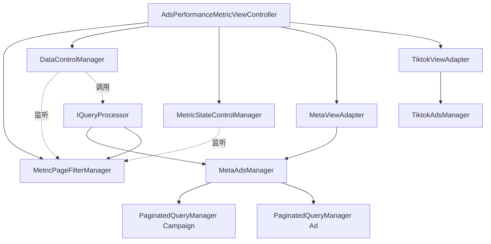

# 实战案例与设计模式深度解析 (Deep Dive)

本文档不仅仅展示代码片段，更旨在传授**如何像资深工程师一样思考**。我们将深入探讨设计模式（策略模式、依赖注入）、接口定义以及如何构建可维护的大型前端应用。

## 1. 设计思维：从需求到架构 (Design Thinking)

当你接到一个复杂需求（例如："做一个支持 Meta 和 TikTok 的广告数据仪表盘"）时，请按以下步骤思考：

### 第一步：领域分析 (Domain Analysis)
*   **共性是什么？** 都有筛选器、表格、分页、排序。
*   **差异是什么？** Meta 有 "Quality Ranking" 指标，TikTok 没有；Meta 的筛选器支持 "Objective"，TikTok 支持 "Campaign Type"。
*   **结论：** 我们需要一个统一的框架来处理共性，用**策略模式 (Strategy Pattern)** 来处理差异。

### 第二步：分层设计 (Layering)
*   **视图层 (View):** 只有一套 UI 骨架（Header, Filter, Table），具体内容由适配器填充。
*   **控制层 (Controller):** 需要一个总指挥 (ViewController) 来协调筛选器和数据加载。
*   **模型层 (Model):** 每个平台需要独立的 Manager 来管理自己的 API 请求和数据状态。

### 第三步：定义接口 (Interface Definition)
在写实现代码前，先定义**接口**。这是模块间的契约。

## 2. 核心模式详解

### A. 策略模式 (Strategy Pattern) - 处理平台差异

我们定义一个 `IViewAdapter` 接口，规定所有平台适配器必须具备的能力。

```ts
// interface/i-view-adapter.ts
export interface IViewAdapter {
  // 1. 状态暴露
  get store: StoreApi<AdapterState>; // 暴露给 UI 的状态
  get isLoading: boolean;

  // 2. 视图配置 (UI 骨架通过这些配置来渲染)
  get filterRules: FilterRules;      // 告诉 UI 该显示哪些筛选器
  get tableColumns: ColumnDef[];     // 告诉 UI 该显示哪些列

  // 3. 差异化渲染 (Render Props)
  renderAboveTable(): ReactNode;     // 在表格上方渲染什么？(比如 Meta 的特殊提示)

  // 4. 行为
  fetchData(filters: any): Promise<void>;
}
```

### B. 依赖注入 (Dependency Injection) - 通过构造函数传入

**重要：** 项目的依赖注入是通过构造函数传入依赖，不需要自动注入、Container 等复杂概念。

不要在类内部直接 `new` 依赖项，而是通过构造函数传入。在创建实例时（`new` 的时候）直接传递依赖。

```ts
// Bad: 紧耦合，难以测试
class ViewController {
  private someService = new SomeService(); 
}

// Good: 通过构造函数传入依赖，简单直接
class ViewController {
  constructor(
    private readonly api: ISomeService,
    private readonly metaManager: MetaAdsManager
  ) {}
}

// 使用时：在创建实例时传递依赖
const userService = useServices(IUserService);
const metaManager = new MetaAdsManager();
const vc = new ViewController(userService, metaManager);
```

### C. 组合优于继承 (Composition over Inheritance)

不要搞复杂的类继承体系。使用组合将小的 Manager 拼装成大的 Controller。

## 3. 实战演练：构建多平台仪表盘

### 目录结构

```text
feature/metric-dashboard/
├── manager/
│   ├── interface/
│   │   └── i-view-adapter.ts       # 【契约】定义适配器接口
│   ├── view-adapter/
│   │   ├── meta-view-adapter.ts    # 【策略A】Meta 实现
│   │   └── tiktok-view-adapter.ts  # 【策略B】TikTok 实现
│   ├── ads-manager/
│   │   ├── meta-ads-manager.ts     # 【数据】Meta 数据管理
│   │   └── tiktok-ads-manager.ts   # 【数据】TikTok 数据管理
│   └── metric-view-controller.ts   # 【总指挥】
└── page/
    └── index.tsx
```

### 步骤 1: 实现数据层 (The Data Layer)

使用 `PaginatedQueryManager` (通用工具) 来管理 API 请求。

```ts
// manager/ads-manager/meta-ads-manager.ts
export class MetaAdsManager {
  // 使用通用工具管理分页、Loading、Error 状态
  readonly queryManager = new PaginatedQueryManager(getMetaCampaignsApi);
  
  // 乐观更新 (Optimistic Update) 示例
  async toggleStatus(id: string, status: string) {
    await this.queryManager.optimisticUpdate({
      executor: () => updateStatusApi(id, status),
      updater: (draft) => {
        const item = draft.find(i => i.id === id);
        if (item) item.status = status;
      }
    });
  }
}
```

### 步骤 2: 实现适配器 (The Strategy)

适配器连接 UI 和 数据层。

```ts
// manager/view-adapter/meta-view-adapter.ts
export class MetaViewAdapter implements IViewAdapter {
  constructor(private manager: MetaAdsManager) {}

  get filterRules() {
    return { showObjective: true, showPixel: true }; // Meta 特有的筛选器
  }

  renderAboveTable() {
    return <MetaCreditAlert />; // Meta 特有的警告组件
  }

  async fetchData(filters: any) {
    // 转换通用筛选参数为 Meta API 参数
    const apiParams = this.transformFilters(filters);
    await this.manager.queryManager.fetch(apiParams);
  }
}
```

### 步骤 3: 实现总控制器 (The Orchestrator)

VC 负责根据当前状态选择正确的策略（适配器）。

```ts
// manager/metric-view-controller.ts
export class MetricViewController {
  // 通过构造函数传入依赖（依赖注入）
  constructor(
    private readonly metaAdapter: MetaViewAdapter,
    private readonly tiktokAdapter: TiktokViewAdapter,
    private readonly filterManager: FilterManager
  ) {
    // 聚合 Store：让 UI 可以一次性订阅所有变化
    this.combinedStore = createCombinedStore([
      filterManager.store,
      metaAdapter.manager.queryManager.store, // 暴露数据状态
      tiktokAdapter.manager.queryManager.store
    ]);
  }

  // 【核心】策略选择
  get currentAdapter(): IViewAdapter {
    const platform = this.filterManager.state.platform;
    return platform === 'Meta' ? this.metaAdapter : this.tiktokAdapter;
  }

  bootstrap() {
    // 监听筛选变化 -> 触发当前适配器的数据拉取
    this.filterManager.onFilterChange((filters) => {
      this.currentAdapter.fetchData(filters);
    });
  }
}
```

### 步骤 4: 视图层实现 (The View)

视图层完全不知道 "Meta" 或 "TikTok" 的存在，它只知道 `IViewAdapter` 接口。

```tsx
// page/index.tsx
export function MetricDashboard() {
  const vc = useMetricViewController();
  const adapter = vc.currentAdapter; // 获取当前策略

  // 从聚合 Store 获取数据
  const { data, isLoading } = useCombinedStore(vc.combinedStore, () => ({
    data: adapter.store.getState().items,
    isLoading: adapter.isLoading
  }));

  return (
    <div>
      <FilterBar />
      
      {/* 渲染差异化区域 */}
      {adapter.renderAboveTable()}

      {/* 渲染通用表格，但配置来自适配器 */}
      <FlexibleTable 
        data={data}
        columns={adapter.tableColumns}
        loading={isLoading}
      />
    </div>
  );
}
```

### 步骤 5: 使用 React Context 提供 ViewController

为了在组件树中共享 ViewController 实例，我们需要使用 React Context。这样可以避免通过 props 层层传递，同时确保 ViewController 的生命周期正确管理。

#### 5.1 创建 Context Provider

```tsx
// context/metric-view-controller-context.tsx
import { createContext, useContext, useEffect, useState, type ReactNode } from 'react';
import { useServices } from '@/feature/services/app-container-service/react-context';
import { MetricViewController } from '../manager/metric-view-controller';
import { MetaViewAdapter } from '../manager/view-adapter/meta-view-adapter';
import { TiktokViewAdapter } from '../manager/view-adapter/tiktok-view-adapter';
import { FilterManager } from '../manager/filter-manager';

// 创建 Context
const MetricViewControllerContext = createContext<MetricViewController | null>(null);

// Provider 组件
export function MetricViewControllerProvider({ children }: { children: ReactNode }) {
  const transientDataService = useServices(ITransientDataService);
  
  // 使用 useState 创建 ViewController 实例，确保只创建一次
  const [vc] = useState(() => {
    // 创建依赖的 Managers
    const filterManager = new FilterManager();
    const metaAdsManager = new MetaAdsManager();
    const tiktokAdsManager = new TiktokAdsManager();
    
    // 创建 Adapters
    const metaAdapter = new MetaViewAdapter(metaAdsManager);
    const tiktokAdapter = new TiktokViewAdapter(tiktokAdsManager);
    
    // 创建 ViewController
    return new MetricViewController(
      transientDataService,
      metaAdapter,
      tiktokAdapter,
      filterManager
    );
  });

  // 生命周期管理
  useEffect(() => {
    vc.bootstrap();
    
    return () => {
      vc.dispose();
    };
  }, [vc]);

  return (
    <MetricViewControllerContext.Provider value={vc}>
      {children}
    </MetricViewControllerContext.Provider>
  );
}

// Hook 用于获取 ViewController
export function useMetricViewController(): MetricViewController {
  const vc = useContext(MetricViewControllerContext);
  
  if (!vc) {
    throw new Error(
      'useMetricViewController must be used within MetricViewControllerProvider'
    );
  }
  
  return vc;
}
```

#### 5.2 在页面中使用 Provider

```tsx
// page/index.tsx
import { MetricViewControllerProvider } from '../context/metric-view-controller-context';
import { MetricDashboardContent } from './metric-dashboard-content';

export function MetricDashboard() {
  return (
    <MetricViewControllerProvider>
      <MetricDashboardContent />
    </MetricViewControllerProvider>
  );
}

// 页面内容组件
function MetricDashboardContent() {
  const vc = useMetricViewController();
  const adapter = vc.currentAdapter;

  // 从聚合 Store 获取数据
  const { data, isLoading } = useCombinedStore(vc.combinedStore, () => ({
    data: adapter.store.getState().items,
    isLoading: adapter.isLoading
  }));

  return (
    <div>
      <FilterBar />
      {adapter.renderAboveTable()}
      <FlexibleTable 
        data={data}
        columns={adapter.tableColumns}
        loading={isLoading}
      />
    </div>
  );
}
```

#### 5.3 在子组件中使用 ViewController

```tsx
// component/filter-bar.tsx
import { useMetricViewController } from '../context/metric-view-controller-context';

export function FilterBar() {
  const vc = useMetricViewController();
  const platform = useCombinedStore(
    vc.combinedStore,
    () => vc.filterManager.state.platform
  );

  const handlePlatformChange = (newPlatform: string) => {
    vc.filterManager.setState((state) => {
      state.platform = newPlatform;
    });
  };

  return (
    <Select value={platform} onChange={handlePlatformChange}>
      <Option value="Meta">Meta</Option>
      <Option value="TikTok">TikTok</Option>
    </Select>
  );
}
```

#### 关键要点：

1. **使用 `useState` 创建 ViewController**：确保 ViewController 实例在组件生命周期内只创建一次
2. **生命周期管理**：在 `useEffect` 中调用 `bootstrap()`，在清理函数中调用 `dispose()`
3. **错误处理**：在 Hook 中检查 Context 是否存在，如果不存在则抛出清晰的错误
4. **依赖注入**：在 Provider 中创建 ViewController 时，通过构造函数传入所需的 Service 和 Manager（在 `new` 的时候传递实例）
5. **类型安全**：Context 的类型是 `MetricViewController | null`，Hook 返回非空的 `MetricViewController`

## 4. 总结：为什么这么设计？

1.  **开闭原则 (Open/Closed Principle):** 如果要加一个 "Google Ads"，只需要新增 `GoogleViewAdapter` 和 `GoogleAdsManager`，不需要修改 VC 或 UI 的核心逻辑。
2.  **关注点分离 (Separation of Concerns):**
    *   UI 只管画图。
    *   VC 只管协调。
    *   Adapter 只管差异。
    *   Manager 只管数据。
3.  **可测试性 (Testability):** 每个 Manager 和 Adapter 都可以单独进行单元测试，不需要启动 React 组件。

---

## 5. 真实案例剖析：My-Ads Metric 模块完整架构

这是一个生产级的复杂模块，展示了如何在真实项目中应用上述所有设计原则。

### 完整目录结构

```text
feature/my-ads/
├── manager/
│   ├── my-ads-manager.ts                    # 【根 Manager】组合所有子 Manager
│   ├── my-ads-filter-manager.ts             # 【筛选】通用筛选逻辑
│   │
│   ├── ads-manager/                         # 【数据层】各平台数据管理
│   │   ├── meta-ads-manager.ts              # Meta 数据：Campaign/AdSet/Ad/Creative
│   │   ├── tiktok-ads-manager.ts            # TikTok 数据
│   │   └── applovin-ads-manager.ts          # AppLovin 数据
│   │
│   ├── performance-metirc/                  # 【核心】指标仪表盘模块
│   │   ├── ads-performance-metirc-view-controller.ts  # 【总控】
│   │   ├── performance-metric-filter-manager.ts       # 【筛选】指标页面专用筛选
│   │   ├── data-control-manager.ts                    # 【调度】监听筛选变化 -> 触发数据刷新
│   │   ├── metric-state-control-manager.ts            # 【状态】URL 同步、消息处理
│   │   │
│   │   ├── query-processor/                # 【查询处理】
│   │   │   ├── meta-query-processor.ts      # Meta 查询逻辑封装
│   │   │   ├── tiktok-query-processor.ts    # TikTok 查询逻辑封装
│   │   │   └── applovin-query-processor.ts  
│   │   │
│   │   ├── view-adapter/                   # 【视图适配器】策略模式核心
│   │   │   ├── meta-metric-page-view-adapter.ts
│   │   │   ├── tiktok-metric-page-view-adapter.ts
│   │   │   └── applovin-metric-page-view-adapter.ts
│   │   │
│   │   └── table-adapter/                  # 【表格适配器】
│   │       └── ...                          # 管理表格列、排序、选中状态
│   │
│   ├── interface/                          # 【契约层】
│   │   ├── i-metric-page-view-adapter.ts    # ViewAdapter 接口定义
│   │   └── i-query-processor.ts             # QueryProcessor 接口定义
│   │
│   └── common/                             # 【通用工具】
│       ├── paginated-query-manager.ts       # 通用分页查询管理器
│       └── ...
│
├── context/
│   └── ads-performance-metric-view-controller-context.tsx
│
└── page/
    └── metric-dashboard-new/
        └── index.tsx
```

### 核心依赖关系图



### 各模块职责详解

#### 1. **AdsPerformanceMetricViewController（总指挥）**

**职责：**
- 组装所有子模块（Managers、Adapters、QueryProcessors）
- 提供 `currentAdapter` 根据平台动态选择适配器
- 聚合所有 Store 到 `combinedStore`，供 UI 订阅
- 统一生命周期管理（bootstrap/dispose）

**依赖注入（通过构造函数传入）：**
```ts
constructor(
  private readonly transientDataService: ITransientDataService,
  private readonly myAdsManager: MyAdsManager  // 通过构造函数传入上层 Manager
) {
  // 内部实例化子模块（这些是内部依赖，不需要注入）
  this.filterManager = new MetricPageFilterManager();
  this.metaAdsManager = new MetaAdsManager();
  this.dataControlManager = new DataControlManager(
    this.filterManager,
    () => this.currentQueryProcessor,  // 延迟绑定
    () => this.viewAdapter
  );
}

// 使用时：在创建实例时传递依赖
const transientDataService = useServices(ITransientDataService);
const myAdsManager = new MyAdsManager();
const vc = new AdsPerformanceMetricViewController(transientDataService, myAdsManager);
```

**为什么用工厂函数 `() => this.currentAdapter`？**
因为 `currentAdapter` 是动态的（依赖筛选器状态），不能在构造时确定。

---

#### 2. **MetricPageFilterManager（筛选器状态）**

**职责：**
- 管理筛选器的所有状态（Platform, DateRange, Campaign, Metrics）
- 提供 `onStateChange` 事件，供其他 Manager 订阅
- 提供工具方法（如 `getFormatDateInfo`）转换状态为 API 参数

**为什么独立？**
筛选器逻辑复杂，且会被多个模块（DataControl, StateControl, ViewAdapter）依赖。

---

#### 3. **DataControlManager（数据调度器）**

**职责：**
- 监听 `FilterManager` 的状态变化
- 判断哪些状态变化需要刷新数据（如 Platform 切换、日期变化）
- 提供防抖机制（500ms），避免频繁请求
- 自动选中前 4 条数据（如果表格支持选中）

**关键代码：**
```ts
private handleFilterChange = ({ changedKeys }) => {
  const shouldRefresh = changedKeys.some(key => 
    this.shouldRefreshKeys.includes(key)
  );
  if (shouldRefresh) {
    this.debouncedFetch();  // 防抖调用
  }
};
```

**为什么需要它？**
避免在 ViewController 中写大量 `if` 判断，职责单一。

---

#### 4. **MetricStateControlManager（状态同步器）**

**职责：**
- URL 参数同步（将筛选器状态同步到 URL，刷新页面后恢复状态）
- 处理跨页面消息（如从"投放页"跳转过来，需要预设筛选条件）

**为什么独立？**
URL 同步和消息处理是纯粹的副作用逻辑，与核心业务无关，应隔离。

---

#### 5. **QueryProcessor（查询处理器）**

**职责：**
- 封装 API 调用逻辑
- 将 `FilterManager` 的状态转换为特定平台的 API 参数
- 调用 `AdsManager` 的 `queryManager.fetch()`

**示例（MetaQueryProcessor）：**
```ts
async fetch() {
  const { adMetricLevel, dateRange } = this.filterManager.state;
  const apiParams = this.transformToMetaParams(dateRange, adMetricLevel);
  
  if (adMetricLevel === 'Campaign') {
    await this.metaAdsManager.campaignQueryManager.fetch(apiParams);
  } else if (adMetricLevel === 'Ad') {
    await this.metaAdsManager.adQueryManager.fetch(apiParams);
  }
}
```

**为什么用接口 `IQueryProcessor`？**
因为 ViewController 不关心具体是 Meta 还是 TikTok，只需要调用 `fetch()`。

---

#### 6. **ViewAdapter（视图适配器）**

**职责：**
- 实现 `IMetricPageViewAdapter` 接口
- 提供视图配置（告诉 UI 显示哪些筛选器、哪些列）
- 提供差异化渲染方法（如 `renderAboveTable()`）
- 封装平台特有逻辑（如 Meta 的 "Quality Ranking" 列）

**示例（MetaViewAdapter）：**
```ts
get adsMetricFilterRules() {
  return {
    show: true,  // Meta 支持 Metric Filter
    props: { ... }
  };
}

renderAboveTable() {
  return <MetaSpecificWarning />;  // Meta 特有的警告提示
}
```

---

#### 7. **AdsManager（数据层）**

**职责：**
- 管理多个 `PaginatedQueryManager` 实例（一个 API 对应一个）
- 提供业务方法（如 `updateAdsStatus` - 乐观更新）
- 聚合所有 QueryManager 的 Store

**示例（MetaAdsManager）：**
```ts
export class MetaAdsManager {
  readonly campaignQueryManager = new PaginatedQueryManager(getCampaignsApi);
  readonly adQueryManager = new PaginatedQueryManager(getAdsApi);
  
  readonly combinedStore = createCombinedStore([
    this.campaignQueryManager.store,
    this.adQueryManager.store
  ]);
}
```

---

### 数据流示例

1. **用户切换日期筛选器**
   → `FilterManager.setState()` 更新状态
   → `FilterManager` 触发 `onStateChange` 事件
   → `DataControlManager` 监听到变化，判断是否需要刷新
   → 调用 `currentQueryProcessor.fetch()`
   → `QueryProcessor` 读取 `FilterManager` 状态，转换为 API 参数
   → 调用 `MetaAdsManager.campaignQueryManager.fetch(apiParams)`
   → API 返回后，`QueryManager` 更新自己的 Store
   → UI 订阅 `combinedStore`，自动渲染新数据

### 关键设计亮点

1. **单一职责原则**：每个 Manager 只做一件事。
2. **依赖倒置**：ViewController 依赖接口（`IViewAdapter`, `IQueryProcessor`），不依赖具体实现。
3. **事件驱动**：通过 Emitter 实现模块间通信，避免紧耦合。
4. **工厂模式**：`currentAdapter` 根据状态动态选择实现类。
5. **组合模式**：ViewController 是多个 Manager 的组合，而不是继承。

---

## 6. 各模块文件写法示例

本节展示不同模块的文件写法示例，帮助理解项目结构和代码组织方式。

### 6.1 `api/` 模块示例

**职责：** 纯粹的 API 请求函数，不包含业务逻辑。

```ts
// api/campaign.api.ts
export async function getCampaignsApi(params: {
  platform: string;
  page: number;
}) {
  return clientRequest<CampaignResponse>({
    url: '/api/campaigns',
    method: 'GET',
    params,
  });
}
```

**关键要点：**
- ✅ 使用 `clientRequest<T>`，第一个泛型参数指定响应类型
- ✅ 只负责 API 调用，不包含数据转换
- ✅ 按领域拆分文件（如 `campaign.api.ts`, `report.api.ts`）
- ❌ 不要在 API 函数中进行数据转换或业务逻辑处理

---

### 6.2 `context/` 模块示例

**职责：** React Context Provider，提供 ViewController 实例。

```tsx
// context/campaign-context.tsx
const Context = createContext<CampaignViewController | null>(null);

export function CampaignProvider({ children }) {
  const userService = useServices(IUserService);
  
  const [vc] = useState(() => {
    return new CampaignViewController(userService);
  });

  useEffect(() => {
    vc.bootstrap();
    return () => vc.dispose();
  }, [vc]);

  return <Context.Provider value={vc}>{children}</Context.Provider>;
}

export function useCampaignViewController() {
  const vc = useContext(Context);
  if (!vc) throw new Error('Must be used within CampaignProvider');
  return vc;
}
```

**关键要点：**
- ✅ 使用 `useState` 创建 ViewController 实例，确保只创建一次
- ✅ 在 `useEffect` 中管理生命周期（`bootstrap`/`dispose`）
- ✅ 通过构造函数传入依赖，在 `new` 的时候传递实例
