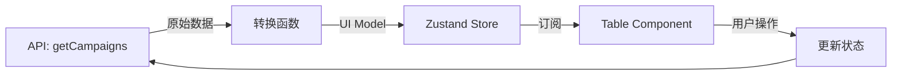

# 重构指南：系统化的代码重构方法论

本指南教你**如何像资深工程师一样思考重构**。重构不是简单的代码搬运，而是对现有系统的深度理解、架构重设计和质量保障的系统工程。

---

## 阶段 1：重构前的深度分析 (Pre-Refactoring Analysis)

**原则：理解优先于行动。** 在动手改代码之前，必须先理解现状。盲目重构的风险极高。

### 1.1 业务逻辑分析 (Business Logic Analysis)

**目标：** 搞清楚"这段代码到底在干什么"。

#### 可执行步骤：
1. **绘制用户交互流程图**
   - 列出所有用户操作路径（如：点击按钮 -> 提交表单 -> 显示结果）
   - 标记每个路径的输入和输出
   - 识别关键业务规则（如："当 status === 'pending' 且 budget < 1000 时禁用提交"）

2. **提取状态转换逻辑**
   - 画出状态图：Draft -> Pending -> Approved -> Rejected
   - 标记触发转换的条件和事件

3. **识别核心领域概念**
   - 列出业务实体（如：Campaign、Ad、Budget）
   - 识别它们之间的关系（如：一个 Campaign 包含多个 Ad）

**输出物：**
```text
用例清单：
1. 用户点击"创建广告" -> 打开表单 -> 填写信息 -> 提交 -> 显示成功/失败
2. 用户切换筛选器 -> 清空选中 -> 重新加载数据 -> 更新表格

状态转换：
Draft --(提交)--> Pending --(审核通过)--> Approved
              |
              +--(审核拒绝)--> Rejected
```

---

### 1.2 数据流分析 (Data Flow Analysis)

**目标：** 理解数据的来源、转换和流向，找出隐藏的依赖。

#### 可执行步骤：
1. **追踪数据源头**
   - API 返回的原始结构是什么？
   - Props 传递了哪些数据？
   - Context/Store 中存储了什么？

2. **识别数据转换点**
   - 哪里进行了格式转换？（如：ISO 时间 -> 本地时间）
   - 哪里进行了计算？（如：sum, average, filter）
   - 哪里进行了验证？（如：非空检查、范围校验）

3. **绘制数据流图**
   - 使用 Mermaid 或手绘，标记：数据源 -> 转换节点 -> 使用节点

**输出物：**


---

### 1.3 约束与依赖分析 (Constraint & Dependency Analysis)

**目标：** 找出隐藏的耦合和约束，避免重构后引入 Bug。

#### 可执行步骤：
1. **识别时序约束**
   - 列出所有 `useEffect` 及其依赖数组
   - 标记"必须先执行 A 再执行 B"的逻辑
   - 例如："必须先 `fetchUser()` 再 `fetchOrders(userId)`"

2. **识别数据约束**
   - 列出所有验证规则（如：Budget > 0, StartDate < EndDate）
   - 这些约束可能散落在 UI、Manager、API 各层

3. **识别副作用链**
   - 修改 A 会触发 B 的刷新吗？
   - 例如："切换 Platform -> 清空 Campaign 筛选 -> 重新加载数据"

**输出物：**
```text
时序约束：
- 必须先调用 bootstrap() 才能使用 Manager
- 必须先设置 adAccountId 才能调用 fetchCampaigns()

数据约束：
- Budget 必须 > 0
- DateRange.from 必须 <= DateRange.to

副作用链：
- FilterManager.platform 变化 -> DataControlManager 触发刷新
- SelectionManager.clear() -> ChartManager 清空高亮
```

---

## 阶段 2：优化思维框架 (Optimization Thinking)

现在你已经理解了现状，接下来从哪些角度优化？

### 2.1 SOLID 原则检查

| 原则 | 问题检查 | 重构方向 |
|------|---------|---------|
| **S** - 单一职责 | 这个类/函数是否做了不止一件事？ | 拆分成多个小 Manager/Hook |
| **O** - 开闭原则 | 如果要加新平台/新功能，是否需要修改核心代码？ | 引入策略模式/适配器模式 |
| **L** - 里氏替换 | 子类是否能无缝替换父类？ | 定义接口契约，确保多态正确性 |
| **I** - 接口隔离 | 接口是否臃肿？实现类是否被迫实现不需要的方法？ | 拆分接口为多个小接口 |
| **D** - 依赖倒置 | 高层模块是否直接依赖低层模块？ | 引入抽象接口，依赖注入 |

**可执行检查：**
- [ ] 组件是否既负责 UI 又负责数据获取？ -> 违反单一职责
- [ ] 代码中是否有大量 `if (platform === 'Meta')`？ -> 违反开闭原则
- [ ] Manager 是否在内部 `new` 依赖项？ -> 违反依赖倒置

---

### 2.2 性能优化角度

| 问题类型 | 检查点 | 优化手段 |
|---------|--------|---------|
| **过度渲染** | 组件是否因为父级状态变化而频繁重渲染？ | 使用 `React.memo`, `useMemo` |
| **冗余请求** | 是否重复请求相同数据？ | 引入缓存机制 |
| **计算阻塞** | 是否有同步的复杂计算阻塞 UI？ | 移到 Web Worker 或使用 `useDeferredValue` |

---

### 2.3 可维护性角度

| 问题类型 | 检查点 | 优化手段 |
|---------|--------|---------|
| **可读性差** | 变量命名是否语义化？是否有过深的嵌套？ | 重命名、提前 return、卫语句 |
| **可测试性差** | 业务逻辑是否被锁死在组件内？ | 提取为纯函数或 Manager 类 |
| **可扩展性差** | 新增功能是否需要改动多处？ | 引入插件机制、事件总线 |

---

## 阶段 3：架构重设计 (Architectural Redesign)

基于分析和优化思维，设计新的架构。

### 3.1 模块拆分思维 (Module Splitting)

#### 拆分维度：

1. **按职责拆分 (By Responsibility)**
   - **原则：** 一个 Manager 只做一件事
   - **例子：** `UserProfile` -> `UserInfoManager` + `UserSettingsManager`

2. **按数据域拆分 (By Data Domain)**
   - **原则：** 不同的数据源对应不同的 Manager
   - **例子：** `Dashboard` -> `CampaignManager` + `MetricManager` + `ChartManager`

3. **按生命周期拆分 (By Lifecycle)**
   - **原则：** 启动逻辑、运行逻辑、清理逻辑分离
   - **例子：** `AppBootstrap` -> `InitManager` + `AuthManager` + `ConfigManager`

4. **按平台拆分 (By Platform)**
   - **原则：** 使用策略模式处理差异
   - **例子：** `AdsManager` -> `MetaAdsManager` + `TiktokAdsManager`

---

### 3.2 职责划分矩阵 (Responsibility Matrix)

为每个模块分配清晰的职责。**这是重构最关键的一步。**

**模板：**
| 模块名称 | 职责范围 | 输入 | 输出 | 依赖 |
|---------|---------|------|------|------|
| FilterManager | 管理筛选器状态 | 用户操作 | Filter State | - |
| DataControlManager | 监听筛选变化，触发数据刷新 | Filter State | - | FilterManager, QueryProcessor |
| QueryProcessor | 封装 API 调用 | API Params | Data | AdsManager |

**可执行步骤：**
1. 为每个模块写一句话描述："XX Manager 负责 YY"
2. 明确输入和输出，确保单向数据流
3. 检查循环依赖：A 依赖 B，B 不能依赖 A

---

### 3.3 协调机制设计 (Coordination Mechanism)

模块之间如何通信？

| 方案 | 适用场景 | 优点 | 缺点 |
|------|---------|------|------|
| **直接调用** | 严格的层级关系（如 VC -> Manager） | 简单直观 | 紧耦合 |
| **事件总线 (Event Emitter)** | 松散耦合的模块（如插件系统） | 解耦性强 | 难以追踪数据流 |
| **依赖注入（通过构造函数传入）** | 需要替换实现的场景（如单测） | 可测试性强，简单直接 | 无额外复杂度 |

**可执行步骤：**
1. 画出模块依赖图，标记通信方向
2. 对于"一对多"的通信（如：一个事件触发多个响应），使用事件机制
3. 对于"一对一"的通信，使用直接调用或依赖注入

---

## 阶段 4：实施重构 (Implementation)

**原则：小步快跑，增量重构。** 不要一次性重写整个文件。

### 4.1 增量重构四步法

#### 第一轮：提取纯函数
- **目标：** 将数据转换、计算逻辑提取为纯函数
- **位置：** `util/` 或 `helper/`
- **检查：** 函数无副作用，相同输入必然相同输出

**示例：**
```ts
// 旧代码（组件内部）
const formattedDate = new Date(rawDate).toLocaleDateString('zh-CN');

// 新代码
// util/date.ts
export function formatDate(date: string): string {
  return new Date(date).toLocaleDateString('zh-CN');
}
```

---

#### 第二轮：提取 Manager/Hook
- **目标：** 将状态和副作用逻辑移出组件
- **位置：** `manager/` 或 自定义 Hook
- **检查：** 组件只负责渲染，不包含复杂逻辑

**示例：**
```ts
// 旧代码（组件内部）
const [data, setData] = useState([]);
useEffect(() => {
  fetch('/api/campaigns').then(res => setData(res));
}, []);

// 新代码
// manager/campaign-manager.ts
export class CampaignManager {
  readonly queryManager = new PaginatedQueryManager(getCampaigns);
  bootstrap() {
    this.queryManager.fetch();
  }
}
```

---

#### 第三轮：拆分 UI 组件
- **目标：** 将大组件拆分为小的"哑组件"
- **位置：** `component/` 或 `block/`
- **检查：** 每个组件不超过 150 行

**拆分原则：**
- 如果一段 JSX 有独立的标题或逻辑分组，它就值得成为一个组件
- `component/`：纯 UI，无副作用
- `block/`：带业务逻辑，依赖 Manager

---

#### 第四轮：优化性能和错误处理
- 加入 Loading、Error 状态
- 加入防抖、节流
- 检查是否有过度渲染

---

### 4.2 重构检查清单

每完成一个模块的重构，必须检查：

- [ ] **功能一致性：** 所有原有功能是否都正常工作？
- [ ] **边界情况：** 空数据、Loading、Error 状态是否处理正确？
- [ ] **性能：** 是否引入了新的性能问题（如过度渲染）？
- [ ] **可读性：** 新代码是否比旧代码更清晰？
- [ ] **可测试性：** 核心逻辑是否可以单独测试？

---

## 阶段 5：质量保障 (Quality Assurance)

**原则：重构后必须验证逻辑正确性。** 但验证方式要务实。

### 5.1 逻辑正确性验证思路

#### 方法 1：对照检查 (Cross-Check)
- 对照原业务流程图：重构后的代码路径是否一致？
- 对照约束清单：所有约束是否都正确实现？
- 对照数据流图：数据的转换链是否完整？

#### 方法 2：回归测试 (Regression Testing)
- 手动测试所有用户路径
- 重点测试边界情况：空数组、null、undefined、极端数值

#### 方法 3：代码审查 (Code Review)
- 让同事审查重构后的代码
- 关注点：是否引入了新的复杂度？是否破坏了原有逻辑？

---

## 阶段 6：软件工程原则 (Engineering Principles)

### 6.1 领域驱动设计 (DDD)

- **识别限界上下文 (Bounded Context)**：广告管理、指标分析、用户设置应该是不同的上下文。
- **定义通用语言 (Ubiquitous Language)**：团队和代码使用一致的术语（如 "Campaign" 而不是混用 "广告系列/Ads"）。

### 6.2 测试驱动思维 (TDD Mindset)

重构时，保持"可测试性"优先：
1. 核心逻辑应该是纯函数或 Manager 类，而不是锁死在组件内
2. 依赖应该通过构造函数传入，方便替换为 Mock（不需要自动注入或 Container）
3. 副作用应该集中管理，而不是散落在各处

---

## 总结：重构的核心原则

1. **理解优先于行动**：不理解原逻辑就重构，等于赌博。
2. **小步快跑**：增量重构，每一步都保证可用。
3. **职责清晰**：每个模块只做一件事，通过组合构建复杂功能。
4. **文档同步**：重构后必须更新架构文档和注释。
5. **代码审查**：重构后的代码必须经过 Code Review。

**记住：好的重构，不是让代码变得更"酷"，而是让未来的自己和同事更轻松。**
