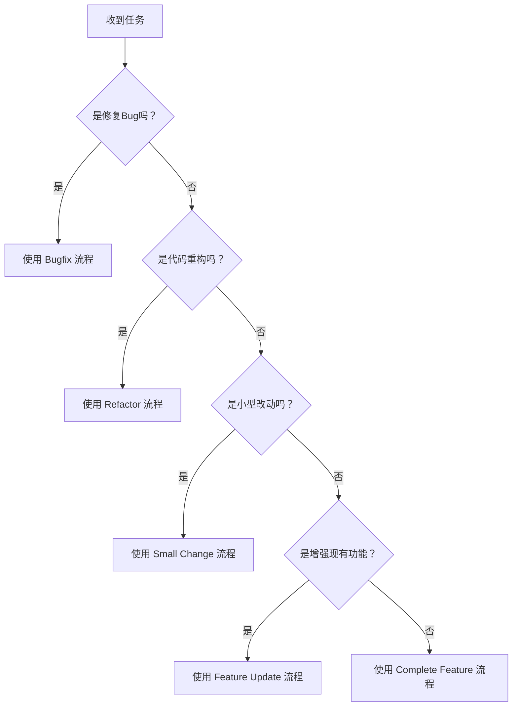

# AI Agent 开发工作流程指南 (AI Agent Development Workflow Guide)

本文档定义了 AI Agent 执行不同类型开发任务的标准工作流程，所有步骤都基于代码分析、工具命令和静态检查，无需人工操作浏览器或 DevTools。

---

## 工作流程分类

根据任务复杂度和范围，我们将开发任务分为五类：

| 类型 | 定义 | 示例 |
|------|------|------|
| **Bugfix** | 修复现有功能的缺陷 | 修复类型错误、修复逻辑错误、修复 API 调用问题 |
| **Small Change** | 小型功能调整或优化 | 添加新的筛选项、调整 UI 布局、添加新的工具函数 |
| **Feature Update** | 现有功能的增强或扩展 | 支持新的广告平台、增加批量操作、扩展现有 Manager |
| **Complete Feature** | 全新功能模块开发 | 新增广告创意分析模块、用户权限系统 |
| **Refactor** | 代码重构和优化 | 提取重复组件、重构 Manager 结构、优化代码组织 |

---

## 通用执行原则

### 1. 代码分析优先
- ✅ 先分析代码结构，理解现有实现
- ✅ 搜索相关代码，理解上下文和依赖关系
- ✅ 理解数据流和模块职责
- ❌ 不要假设代码结构，必须先分析

### 2. 工具命令验证
- ✅ 每次修改后运行类型检查确保没有类型错误
- ✅ 每次修改后运行代码格式检查确保格式正确
- ✅ 每次修改后运行代码质量检查确保符合规范
- ✅ 读取并修复所有 lint 错误
- ❌ 不要跳过类型检查和 lint 检查

### 3. 增量修改
- ✅ 每次只修改必要的文件
- ✅ 保持修改范围最小化
- ✅ 遵循现有代码风格和架构模式
- ❌ 不要一次性修改大量无关文件

### 4. 验证步骤
- ✅ 运行类型检查确保没有类型错误
- ✅ 运行 lint 检查确保代码质量
- ✅ 检查导入导出是否正确
- ✅ 检查是否有未使用的代码

### 5. ESM 模块化规范
- ✅ 使用 ESM（ES Module）模块化规范
- ✅ 使用静态导入：`import { ... } from './path'`
- ✅ 使用命名导出：`export { ... }` 或 `export const ...`
- ❌ **禁止使用动态导入**：不允许使用 `import()`、`require()` 或 `await import()`
- ❌ **禁止使用 CommonJS**：不允许使用 `module.exports` 或 `require()`

---

## 工作流程 1：Bugfix（修复缺陷）

**原则：快速定位，最小改动，工具验证。**

### 步骤 1：问题定位 (Locate)

1. **理解问题描述**
   - 明确问题现象（如：类型错误、运行时错误、逻辑错误）
   - 确定问题发生的文件或模块
   - 理解预期行为

2. **代码搜索与分析**
   - 搜索问题相关的功能或模块代码
   - 搜索具体的错误信息或关键词
   - 读取相关文件理解上下文和依赖关系

3. **定位根因**
   - 分析数据流：数据来源 -> 转换 -> 使用
   - 检查类型定义是否匹配
   - 检查 API 调用是否正确
   - 检查状态管理逻辑

4. **确认影响范围**
   - 搜索相关代码的使用位置
   - 检查是否有其他文件依赖被修改的代码
   - 评估修改的影响范围

### 步骤 2：修复实施 (Fix)

**修复原则：**
- ✅ 最小改动：只改必须改的地方
- ✅ 保持架构：不引入新的技术债
- ✅ 遵循现有模式：使用项目中已有的实现方式
- ❌ 避免"顺手重构"：Bugfix 不是重构的时机

**代码修改流程：**
1. 读取需要修改的文件，理解完整上下文
2. 进行精确修改，保持代码风格一致
3. 确保修改符合项目代码风格和架构规范

### 步骤 3：验证与测试 (Verify)

1. **类型检查**
   - 运行类型检查确保没有类型错误
   - 修复所有类型相关问题

2. **代码质量检查**
   - 运行代码格式检查
   - 运行代码质量检查
   - 读取 lint 错误并修复所有问题

3. **检查清单**
   - [ ] 类型检查通过
   - [ ] 代码格式正确
   - [ ] 代码质量检查通过
   - [ ] 没有未使用的导入
   - [ ] 没有 console.log 残留
   - [ ] 修改范围最小化
   - [ ] 没有使用动态导入（`import()`、`require()`）

---

## 工作流程 2：Small Change（小功能改动）

**原则：理解现有架构，遵循现有模式，不破坏一致性。**

### 步骤 1：需求理解 (Understand)

1. **明确需求**
   - 理解需要实现的功能
   - 确定需要修改或新增的文件
   - 理解数据流和交互流程

2. **评估影响范围**
   - 需要修改哪些文件？
   - 是否需要新增文件？
   - 是否需要修改类型定义？

### 步骤 2：查找现有模式 (Find Patterns)

**关键问题：**
- 项目中是否已有类似功能？
- 现有的实现方式是什么？
- 我应该遵循哪个模式？

**查找方法：**
- 在 `feature/` 目录下搜索类似功能
- 查看现有的 Manager/Hook 实现
- 检查 `component/` 和 `block/` 中是否有可复用的组件
- 查看类型定义文件理解数据结构
- 读取现有实现理解模式和架构

### 步骤 3：实施改动 (Implement)

**遵循现有架构：**

| 场景 | 应该做什么 | 不应该做什么 |
|------|-----------|-------------|
| 需要新增筛选器 | 在 `FilterManager` 中添加新字段 | 在组件中用 `useState` 管理筛选状态 |
| 需要调用新 API | 在 `api/` 目录下添加新函数 | 在组件中直接 `fetch()` |
| 需要新增 UI 组件 | 在 `component/` 或 `block/` 中创建 | 在 Page 中内联一个大组件 |
| 需要新增类型 | 在 `type.ts` 中添加类型定义 | 在组件中内联类型定义 |

**实施步骤：**
1. 创建或修改必要的文件
2. 遵循项目的目录结构标准
3. 使用现有的组件和工具函数
4. 保持代码风格一致

### 步骤 4：验证与提交 (Verify)

1. **类型检查**
   - 运行类型检查确保没有类型错误

2. **代码质量检查**
   - 运行代码格式检查
   - 运行代码质量检查

3. **检查清单**
   - [ ] 类型检查通过
   - [ ] 代码格式正确
   - [ ] 代码质量检查通过
   - [ ] 遵循了现有的代码风格
   - [ ] 遵循了项目的架构规范
   - [ ] 没有引入不必要的依赖
   - [ ] 没有使用动态导入（`import()`、`require()`）

---

## 工作流程 3：Feature Update（功能增强）

**原则：先设计后实现，保持向后兼容，逐步迭代。**

### 步骤 1：需求分析与设计 (Analyze & Design)

1. **需求拆解**
   - 将大需求拆分为小任务
   - 识别核心功能和次要功能
   - 确定优先级

2. **代码分析**
   - 分析现有功能实现
   - 理解现有架构和模块职责
   - 查找可复用的代码和组件

3. **架构设计**
   - 是否需要新增 Manager？
   - 是否需要调整现有模块的职责？
   - 数据流是怎样的？
   - 需要新增哪些类型定义？

4. **评估风险**
   - 是否会影响现有功能？
   - 是否需要修改现有接口？
   - 是否需要数据迁移？

**输出物：**
- 列出需要修改的文件列表
- 列出需要新增的文件列表
- 描述数据流和模块职责

### 步骤 2：分阶段实施 (Phased Implementation)

**推荐顺序：**

#### 阶段 1：基础设施 (Infrastructure)
- 创建必要的目录结构
- 定义接口（Interface）和类型（Type）
- 创建 Manager 骨架（只有 `bootstrap` 和 `dispose`）
- 运行类型检查确保基础结构正确

#### 阶段 2：数据层 (Data Layer)
- 实现 API 调用函数（在 `api/` 目录）
- 实现 Manager 的数据获取逻辑
- 实现状态管理（Zustand Store）
- 运行类型检查确保数据层正确

#### 阶段 3：视图层 (View Layer)
- 实现基础 UI 组件（在 `component/` 目录）
- 实现 Block 组件（在 `block/` 目录）
- 组装 Page 组件
- 运行类型检查和 lint 检查

#### 阶段 4：交互与优化 (Interaction & Optimization)
- 实现用户交互逻辑
- 添加 Loading/Error 状态处理
- 优化代码结构和性能
- 最终验证所有检查通过

### 步骤 3：增量验证 (Incremental Verification)

**每个阶段完成后：**
1. 运行类型检查
2. 运行代码格式检查
3. 运行代码质量检查
4. 读取并修复所有错误

**不要一次性提交所有代码！** 按阶段验证和提交。

### 步骤 4：最终验证 (Final Verification)

- [ ] 所有类型检查通过
- [ ] 所有 lint 检查通过
- [ ] 代码遵循项目架构规范
- [ ] 所有 Manager 都实现了 `bootstrap` 和 `dispose`
- [ ] 没有未使用的导入和代码
- [ ] 代码可读性和可维护性良好
- [ ] 没有使用动态导入（`import()`、`require()`）

---

## 工作流程 4：Complete Feature（完整功能开发）

**原则：Spec 优先，架构先行，质量保障。**

### 步骤 1：Spec 编写（规格说明编写）

**这是最重要的步骤，必须先完成 Spec 才能开始编码。**

#### 1.1 需求分析
- 理解功能需求，明确用户场景
- 列出功能清单和用例
- 确定核心功能和次要功能
- 识别边界情况和异常处理

#### 1.2 代码调研
- 搜索类似功能的实现，理解现有模式
- 查找可复用的组件和工具函数
- 理解项目的架构模式和目录组织方式
- 查看现有 Manager 和 ViewController 的实现方式

#### 1.3 架构设计 Spec

**必须详细设计以下内容：**

**1.3.1 模块划分**
- 列出所有需要的 Manager 及其职责
- 列出所有需要的 Service 依赖
- 描述 Manager 之间的依赖关系
- 描述 ViewController 和 Manager 的关系

**1.3.2 数据建模**
- 列出所有核心实体和数据结构
- 描述数据流：数据来源 -> 转换 -> 存储 -> 使用
- 列出所有需要的类型定义（Type/Interface）
- 描述状态管理方案（哪些用 Zustand Store，哪些用 CombinedStore）

**1.3.3 接口定义**
- 定义所有 Manager 的接口（Interface）
- 明确每个方法的输入输出类型
- 定义所有 API 函数的签名
- 定义所有组件的 Props 类型

**1.3.4 目录结构设计**
- 列出所有需要创建的文件和目录
- 列出所有需要修改的文件
- 遵循项目的目录结构标准
- 明确每个文件的职责
- **重要：** 不需要创建统一的 `index.ts` 或 `index.tsx` 导出文件，直接使用具体文件的导入路径

**1.3.5 组件设计**
- 列出所有需要的 UI 组件（component/）
- 列出所有需要的 Block 组件（block/）
- 描述组件的层级关系和组合方式
- 明确组件的复用性

**1.3.6 数据流设计**
- 描述用户交互触发的事件流
- 描述数据获取和更新的流程
- 描述错误处理和 Loading 状态的处理
- 描述状态更新的时机和方式

**输出物：**
- 完整的 Spec 文档，包含以上所有内容
- 文件清单：列出所有需要创建和修改的文件
- 类型定义清单：列出所有需要定义的类型
- 接口定义清单：列出所有需要定义的接口

### 步骤 2：Spec 评审与确认

**在开始编码前，必须确认：**
- [ ] Spec 是否完整？是否覆盖了所有功能点？
- [ ] 架构设计是否合理？是否符合项目规范？
- [ ] 目录结构是否正确？是否符合项目标准？
- [ ] 类型定义是否完整？是否考虑了所有边界情况？
- [ ] 是否有遗漏的依赖关系？

**只有 Spec 确认无误后，才能进入编码阶段。**

### 步骤 3：搭建骨架 (Scaffolding)

**严格按照 Spec 中的目录结构设计创建文件：**

1. **创建目录结构**
   - 按照 Spec 中的目录结构创建所有目录
   - 确保目录命名符合项目规范

2. **创建类型定义文件**
   - 在 `type.ts` 中定义所有类型
   - 确保类型定义完整且正确

3. **创建接口定义文件**
   - 在 `manager/interface/` 中定义所有 Manager 接口
   - 确保接口定义完整且符合项目规范

4. **创建 Manager 骨架**
   - 创建所有 Manager 文件，只包含 `bootstrap` 和 `dispose` 方法
   - 确保构造函数和依赖注入正确

5. **创建组件骨架**
   - 创建所有组件文件，只包含基本的组件结构
   - 确保 Props 类型定义正确

**验证骨架：**
- 运行类型检查确保所有类型定义正确
- 确保目录结构符合项目标准
- 确保所有文件都能正确导入导出
- **重要：** 不要创建统一的 `index.ts` 或 `index.tsx` 导出文件，直接使用具体文件的导入路径

### 步骤 4：分阶段实现 (Phased Implementation)

**严格按照 Spec 中的设计逐步实现：**

#### 阶段 1：数据层实现
- 实现所有 API 调用函数（在 `api/` 目录）
- 实现 Manager 的数据获取逻辑
- 实现状态管理（Zustand Store 或 CombinedStore）
- 运行类型检查确保数据层正确

#### 阶段 2：业务逻辑层实现
- 实现 Manager 的所有业务方法
- 实现 ViewController 的交互逻辑
- 实现错误处理和边界情况处理
- 运行类型检查确保业务逻辑正确

#### 阶段 3：视图层实现
- 实现基础 UI 组件（在 `component/` 目录）
- 实现 Block 组件（在 `block/` 目录）
- 组装 Page 组件
- 运行类型检查和 lint 检查

#### 阶段 4：交互与优化
- 实现用户交互逻辑
- 添加 Loading/Error 状态处理
- 优化代码结构和性能
- 最终验证所有检查通过

### 步骤 5：增量验证 (Incremental Verification)

**每个阶段完成后：**
1. 运行类型检查
2. 运行代码格式检查
3. 运行代码质量检查
4. 读取并修复所有错误
5. 对照 Spec 检查实现是否完整

### 步骤 6：最终验证 (Final Verification)

- [ ] 对照 Spec 检查所有功能是否实现
- [ ] 所有类型检查通过
- [ ] 所有 lint 检查通过
- [ ] 代码遵循项目架构规范
- [ ] 所有 Manager 都实现了 `bootstrap` 和 `dispose`
- [ ] 依赖注入正确（通过构造函数传入依赖，在 `new` 的时候传递实例）
- [ ] 没有"上帝组件"（组件职责单一）
- [ ] 代码可读性和可维护性良好
- [ ] 没有未使用的导入和代码
- [ ] 没有使用动态导入（`import()`、`require()`）

---

## 工作流程 5：Refactor（代码重构）

**原则：保持功能不变，提升代码质量，逐步重构。**

### 步骤 1：重构目标分析 (Analyze Refactoring Goals)

1. **明确重构目标**
   - 为什么要重构？（如：代码重复、结构混乱、性能问题）
   - 重构的目标是什么？（如：提取组件、优化结构、提升可维护性）
   - 重构的范围是什么？（单个文件、单个模块、还是跨模块）

2. **代码分析**
   - 分析需要重构的代码结构
   - 识别重复代码和模式
   - 理解代码的依赖关系和使用场景
   - 评估重构的影响范围

3. **制定重构计划**
   - 列出重构的具体步骤
   - 确定重构的优先级
   - 识别重构的风险点
   - 确定验证方法

### 步骤 2：重构设计 (Refactoring Design)

**必须设计以下内容：**

#### 2.1 目标结构设计
- 描述重构后的代码结构
- 列出需要提取的组件或函数
- 描述新的模块职责划分
- 描述新的依赖关系
- **重要：** 不需要创建统一的 `index.ts` 或 `index.tsx` 导出文件，直接使用具体文件的导入路径

#### 2.2 重构步骤设计
- 将重构拆分为多个小步骤
- 每个步骤应该是独立的、可验证的
- 确保每个步骤完成后代码仍然可以正常工作
- 确定每个步骤的验证方法

#### 2.3 影响范围分析
- 列出所有需要修改的文件
- 列出所有受影响的依赖文件
- 评估重构对现有功能的影响
- 确定是否需要更新类型定义

**输出物：**
- 重构设计文档，包含目标结构和重构步骤
- 文件清单：列出所有需要创建、修改、删除的文件
- 步骤清单：列出所有重构步骤和验证方法

### 步骤 3：重构实施 (Refactoring Implementation)

**严格按照重构设计逐步实施：**

#### 原则：
- ✅ 每次只完成一个小的重构步骤
- ✅ 每个步骤完成后立即验证
- ✅ 保持功能不变，只改变代码结构
- ✅ 遵循项目的代码规范和架构模式
- ❌ 不要一次性进行大规模重构
- ❌ 不要在重构时添加新功能

#### 常见重构类型：

**3.1 提取组件**
- 识别重复的 UI 结构
- 创建新的组件文件
- 提取公共逻辑和 Props
- 更新所有使用位置
- 验证功能不变

**3.2 提取工具函数**
- 识别重复的业务逻辑
- 创建新的工具函数文件
- 提取公共逻辑
- 更新所有使用位置
- 验证功能不变

**3.3 重构 Manager 结构**
- 分析 Manager 的职责是否单一
- 拆分过大的 Manager
- 合并过小的 Manager
- 优化 Manager 之间的依赖关系
- 验证功能不变

**3.4 优化代码组织**
- 调整文件目录结构
- 移动文件到正确的位置
- 更新所有导入路径
- 验证功能不变
- **重要：** 不要创建统一的 `index.ts` 或 `index.tsx` 导出文件，直接使用具体文件的导入路径

### 步骤 4：增量验证 (Incremental Verification)

**每个重构步骤完成后：**
1. 运行类型检查确保没有类型错误
2. 运行代码格式检查确保格式正确
3. 运行代码质量检查确保符合规范
4. 读取并修复所有 lint 错误
5. 验证功能是否仍然正常工作（通过类型检查）

**重要：** 每个重构步骤都应该是独立的、可回滚的。如果某个步骤出现问题，应该立即回滚。

### 步骤 5：最终验证 (Final Verification)

- [ ] 所有重构步骤已完成
- [ ] 所有类型检查通过
- [ ] 所有 lint 检查通过
- [ ] 代码结构符合项目规范
- [ ] 没有引入新的技术债
- [ ] 代码可读性和可维护性提升
- [ ] 没有未使用的导入和代码
- [ ] 没有使用动态导入（`import()`、`require()`）
- [ ] 重构目标已达成

---

## 工具命令参考

### 类型检查
- 增量类型检查（推荐，速度快）
- 完整类型检查

### 代码格式化和检查
- Biome 检查和自动修复
- ESLint 检查
- 运行所有 lint 检查

### 完整检查（提交前）
- 运行所有检查（类型 + 格式 + lint）

---

## 决策树：我该使用哪个工作流程？

---

## 常见问题处理

### 问题 1：类型错误
1. 运行类型检查查看具体错误
2. 读取类型错误详情
3. 检查类型定义是否正确
4. 检查导入导出是否正确

### 问题 2：Lint 错误
1. 运行代码格式检查和代码质量检查
2. 读取错误详情
3. 根据错误信息修复代码
4. 如果项目有自动修复命令，可以使用

### 问题 3：找不到相关代码
1. 进行语义搜索查找相关代码
2. 搜索关键词查找具体位置
3. 查看项目目录结构理解组织方式
4. 阅读相关规则文档理解架构模式

### 问题 4：不确定实现方式
1. 搜索项目中类似的实现
2. 查看项目的规则文档（如 `mvc-architecture.mdc`）
3. 查看现有代码的模式
4. 遵循项目的架构标准

### 问题 5：Spec 设计不完整
1. 重新分析需求，补充遗漏的功能点
2. 重新分析代码结构，补充遗漏的模块
3. 重新设计架构，确保所有依赖关系清晰
4. 只有在 Spec 完整后才能开始编码

---

## 结语

这个工作流程是为了帮助 AI Agent：
1. **减少决策成本**：不需要每次都从零思考"怎么做"
2. **保证代码质量**：统一的流程确保了统一的质量标准
3. **提升执行效率**：明确的步骤确保高效执行
4. **避免返工**：Spec 优先的方法确保先设计后实现，减少返工

**重要原则：**
- **Spec 优先**：对于功能开发，必须先完成 Spec 设计，确认无误后才能开始编码
- **增量验证**：每个步骤完成后都要验证，确保代码质量
- **最小改动**：Bugfix 和 Small Change 要保持改动范围最小化
- **逐步重构**：Refactor 要分步骤进行，每个步骤都要验证
- **ESM 模块化**：严格使用 ESM 规范，禁止动态导入（`import()`、`require()`）

**记住：流程是为了更好地写代码，不是为了流程而流程。在实际执行中，可以根据具体情况灵活调整。**
